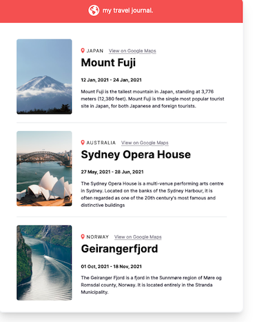

# Travel Journal

My code for the solo project for section 2 of Scrimba's Learn React for Free course.

## [Live Site](https://andrewhuntington.github.io/travel-journal/)

# Screen Shot

# Technologies Used

- React
  - Components with props being passed data from one component to another
- TypeScript
- Tailwind CSS

# Reflection

This is a simple project built for a solo course. It is a review of passing data as props between components and using the map function to loop through an array of objects to display multiple components of the same type.
